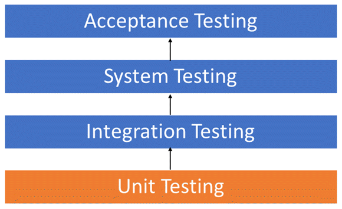
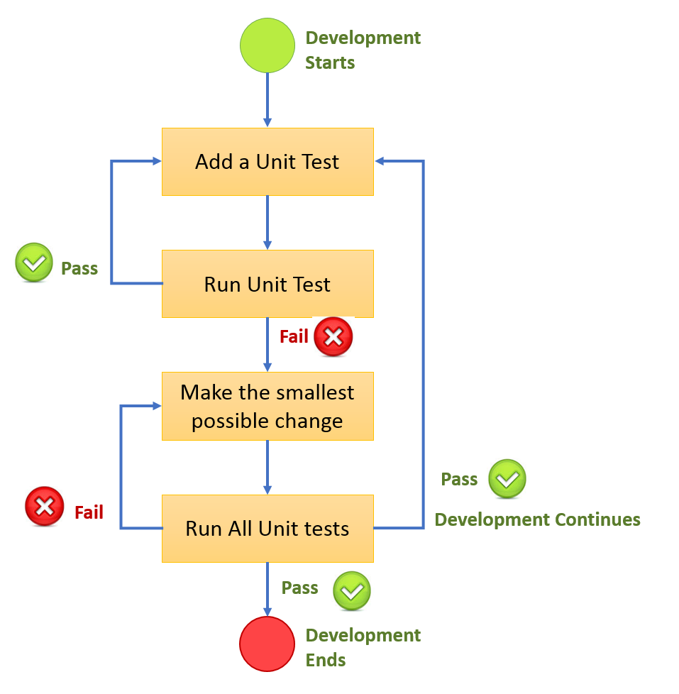

# Unit testing
Unit Testing is a software testing technique by means of which individual units of software i.e. group of computer program modules, usage procedures and operating procedures are tested to determine whether they are suitable for use or not. It is a testing method using which every independent modules are tested to determine if there are any issue by the developer himself. It is correlated with functional correctness of the independent modules.

` Note-  Unit testing is first level of testing done before integration testing. Unit testing is such type of testing technique that is usually performed by the developers `

## Objective of Unit Testing
The objective of Unit Testing is:

- To isolate a section of code.
- To verify the correctness of code.
- To test every function and procedure.
- To fix bug early in development cycle and to save costs.
- To help the developers to understand the code base and enable them to make changes quickly.
- To help for code reuse.


<small> Level of testing [1.1] </small>

## Workflow of Unit Testing



## Advantages of Unit Testing
- Unit Testing allows developers to learn what functionality is provided by a unit and how to use it to gain a basic understanding of the unit API.
- Unit testing allows the programmer to refine code and make sure the module works properly.
- Unit testing enables to test parts of the project without waiting for others to be completed.

## Unit Testing Libraries/Tools:
- PHPUnit
- PyUnit
- Jtest etc.

> Some framework have their own inbuilt testing libraries

## code snippet 

> API to get user authentication token
```python
class Auth(ObtainAuthToken):

    def post(self, request, *args, **kwargs):
        serializer = self.serializer_class(data=request.data,
                                           context={'request': request})
        serializer.is_valid(raise_exception=True)
        user = serializer.validated_data['user']
        token, created = Token.objects.get_or_create(user=user)
        return Response({
            'token': token.key,
            'user_id': user.pk,
            'email': user.email
        })

```
> Request data
```json
{
    "username": "shivam",
    "password": 12345
}
```

> Response
```json
{
    "token": "24c4fe7b0f5f7ba61372b873f17a96a531369af7",
    "user_id": 10,
    "email": "anuj.dev@hotmail.com"
}
```

> Testing
```python
class AuthTest(APITestCase):
    fixtures = ['service/fixture/users.json']

    def test_user_auth(self):
        """
        Ensure if user credential is valid, this will return us the
        user authentication token
        """
        url = reverse('user_auth')
        data = {"username": "shivam", "password": 12345}
        response = self.client.post(url, data, format='json')
        self.assertEqual(response.status_code, status.HTTP_200_OK)
        self.assertNotEqual(response.json().get('token', False), False)
```


Fore more snippets and codable insights explore the repo !

https://github.com/aks97cs/xeo_users